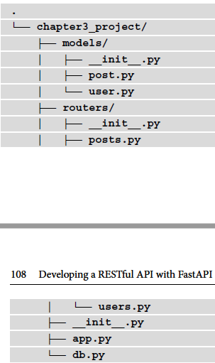

# Developing a RESTful API with FastAPI

## Creating the first endpoint and running it locally 

```python 
from fastapi import FastAPI

app = FastAPI()
@app.get("/")
async def hello_world():
    return {"hello":"world"}
```
The to run it, need a web server compatible with fastapi, in this case uvicorn.

```bash
uvicorn *name_of_script:app

```
And you can also interect with a fastAPI interactive userinterface:


## Handeling request parameters:

The main goal of a REST API is to provide a structured way in which to interact with data.
As such, it's crucial for the end user to send some information to tailor the response they
need, such as path parameters, query parameters, body payloads, or headers.

To handle them, usually, web frameworks ask you to manipulate a request object to
retrieve the parts you are interested in and manually apply validation. However, that's
not necessary with FastAPI! Indeed, it allows you to define all of your parameters
declaratively. Then, it'll automatically retrieve them in the request and apply validations
based on the type hints.

Next, we'll explore how you can use this feature to retrieve and validate this input data
from different parts of the request.

### Path parameters

```python
from fastapi import FastAPI

app = FastAPI()

@app.get("/users/{id}")
async def get_user(id:int):
    return {"id": id}
```

### Limiting allowed values:

So, what if we just want to accept a limited set of values? Once again, we'll lean on type
hinting. Python has a very useful class for this: Enum. An enumeration is a way to list
all the valid values for a specific kind of data. Let's define an Enum class that will list the
different types of users:

```python
from enum import Enum
from fastapi import FastAPI

class UserType(str, Enum):
    STANDARD = "standard"
    ADMIN = "admin"

```

To define a string enumeration, we inherit from both the str type and the Enum class.
Then, we simply list the allowed values as class properties: the property name and its
actual string value. Finally, we need to type hint the type argument using this class:

```python
from fastapi import FastAPI

app = FastAPI()

@app.get("/users/{type}/{id}")
async def get_user(type: UserType,id:int):
    return {"type":type,"id": id}
```

### Advance Validation:

We can take one step further by defining more advanced validation rules, particularly for
numbers and strings. In this case, the type of hint is no longer enough. We'll rely on the
functions provided by FastAPI, allowing us to set some options on each of our parameters.
For path parameters, the function is named Path. In the following example, we'll only
allow an id argument that is greater than or equal to 1:

```python
from fastapi import FastAPI, Path

app = FastAPI()

@app.get("/users/{id}")
async def get_user(id:int=Path(..., ge=1)):
    return {"id": id}
```

More complex validations:

```python
from fastapi import FastAPI, Path

app = FastAPI()

@app.get("/users/{id}")
async def get_license_plate(license:str=Path(..., min_length=9, max_length=9)):
    return {"license": license}
```

```python
from fastapi import FastAPI, Path

app = FastAPI()

@app.get("/users/{id}")
async def get_license_plate(license:str=Path(..., regex=r"^\w{2}-\d{3}-\w{2}$")):
    return {"license": license}
```

### Query parameters:

Query parameters are a common way to add some dynamic parameters to a URL. You
find them at the end of the URL in the following form: *?param1=foo&param2=bar*.
In a REST API, they are commonly used on read endpoints to apply pagination, a filter, a
sorting order, or selecting fields.

```python
@app.get("/users")
async def get_user(page:int,size:int=10):
    return {"page": page, "size":size}
```
Here, you can see that we have defined a default value for those arguments, which means
they are optional when calling the API. Of course, if you wish to define a required query
parameter, simply leave out the default value:

```python
from enum import Enum
from fastapi import FastAPI

class UserFormat(str, Enum):
    SHORT='shor'
    FULL='full'

@app.get("/users")
async def get_user(format:UserFormat):
    return {"format":format}
```


### The request body

The body is the part of the HTTP request that contains raw data, representing documents,
files, or form submissions. In a REST API, it's usually encoded in JSON and used to create
structured objects in a database.
For the simplest cases, retrieving data from the body works exactly like query parameters.
The only difference is that you always have to use the Body function; otherwise, FastAPI
will look for it inside the query parameters by default. Let's explore a simple example
where we want to post some user data:

```python
@app.post("/users")
async def create_user(name:str = Body(...), age:int = Body(...)):
    return {"name":name, "age":age}
```

You also have access to more advanced validation through the Body function. It works in
the same way as we demonstrated in the Path parameters section.

However, defining payload validations like this has some major drawbacks. First, it's quite
verbose and makes the path operation function prototype huge, especially for bigger
models. Second, usually, you'll need to reuse the data structure on other endpoints or in
other parts of your application.

This is why FastAPI uses pydantic models for data validation. Pydantic is a Python library
for data validation and is based on classes and type hints. In fact, the Path, Query, and
Body functions that we've learned about so far use pydantic under the hood!
By defining your own pydantic models and using them as type hints in your path
arguments, FastAPI will automatically instantiate a model instance and validate the data.
Let's rewrite our previous example using this method:

```python
from fastapi import FastAPI
from pydantic import BaseModel

class User(BaseModel):
    name:str
    age: int

app = FastAPI()

@app.post("/users")
async def create_user(user: User):
    return user
```

### Multiple Objects

Sometimes, you might find that you have several objects that you wish to send in the
same payload all at once. For example, both user and company. In this scenario, you
can simply add several arguments that have been type hinted by a pydantic model, and
FastAPI will automatically understand that there are several objects. In this configuration,
it will expect a body containing each object indexed by its argument name:

```python
@app.post("users")
async def create_user(user:User, company:Company):
    return {"user":user,"company":company}
```


### Form data and file uploads

Even if REST APIs work most of the time with JSON, sometimes, you might have
to handle form-encoded data or file uploads, which have been encoded either as
application/x-www-form-urlencoded or multipart/form-data.

One drawback to this approach is that the uploaded file is entirely stored in memory. So,
while it'll work for small files, it is likely that you'll run into issues for larger files. Besides,
manipulating a bytes object is not always convenient for file handling.
To fix this problem, FastAPI provides an UploadFile class. This class will store the data
in memory up to a certain threshold and, after this, will automatically store it on disk in
a temporary location. This allows you to accept much larger files without running out of
memory. Furthermore, the exposed object instance exposes useful metadata, such as the
content type, and a file-like interface. This means that you can manipulate it as a regular
file in Python and that you can feed it to any function that expects a file.


### Headers and cookies

Besides the URL and the body, another major part of the HTTP request are the headers.
They contain all sorts of metadata that can be useful when handling requests. A common
usage is to use them for authentication, for example, via the famous cookies.

```python
@app.get("/")
async def get_header(hello:str=Header(...)):
    return {"hello":hello}
```

### The request object

 Sometimes you find that you need to access a raw request object with all of the data associated with it.
 That's possible, simply declare an argument on your path operation function type hinted with the Request class:

 ```python
 from fastapi import FastAPI, Request

 app = FastAPI()

 @app.get("/")
 async def get_request_object(request: Request):
    return {"path": request.url.path}

 ```

 # Customizing the response:

 Most of the time, you'll want to customize this response a bit further; for instance, by changing the status code, raising validation errors, and setting cookies. FastAPI offers different ways to do this, from the simplest case to the most advanced one. First, we'll learn how to customize the response declaratively by using path operations parameters. 

## Path Operations parameter:

The decorator accept multiple parameters and options, including the ones to customize the response.

### The status code:

By default, FastAPI will always set 200 status when everything goes well during your path operation function execution. Sometimes, it might be useful to change this status, for example is good pratice in REST API to return a 201 Created status when the execution of the endpoint ends up in the creation of a new object. 

```python 

from fastapi import FastAPI, status
from pydantic import BaseModel

class Post(BaseModel):
    title : str

app = FastAPI()

@app.post("/posts", status_code=status.HTTP_201_CREATED)
async def create_post(post: Post):
    return post
```

### The response model

Quite often you might find that there are some differences between the input data, the data you want to store in your database, and the data your want to store in your database, and the data you want to show to the end user. For instance some fields are private or only for internal use, or perhaps some fields are only useful during the creation process and then discarded afterward.

Now lets consider a simple example. Assume you have a database containing blob posts. Those blogs post have several properties, such as title, content or creation date. Additionally you store the number of views of each one, but you don't want the end user to see any of this.

```python
from fastapi import FastAPI
from pydantic import BaseModel

class Post(BaseModel):
    title: str
    nb_views: int

app = FastAPI()

# Dummy database:
posts = {
    1: Post(title="Hello", nb_views=100),
}

@app.get("/posts/{id}")
async def get_post(id: int):
    return posts[id]
```


You can see that the response shows to views, now if we want to cover this we need to specify another model that only outputs the properties we want. First we can define another pydantic model with only the title property:

```python
class PublicPost(BaseModel):
    title: str
```

then the only change is to add the response_model option as keyword argument for the path decorator:

```python
@app.get("/posts/{id}", response_model=PublicPost)
async def get_post(id:int):
    return posts[id]

```

## The response parameter:

The body and status code are not the only interesting parts of nan HTTP response. Sometimes, it might be useful to return some custom header or set cookies. This can be donde dynamically using FastAPI directly within the path operation logic. How so? By injecting the Response as an argument of the path operation function.

### Setting headers:

This only involves setting the proper type hinting to the argument. The following example shows you how to set a custom header:

```python
from fastapi import FastAPI, Response

app = FastAPI()

@app.get("/")
async def custom_header(response: Response):
    response.headers['Custom-Header'] = "Custom-Header-Value"
    return {"hello":"world"}

```

### Setting cookies:

Cookies can also be particularly useful when you want to maintain the user's state within the browser between each of their visits. 

To prompt the browser to save some cookies in your response, you could, of course, build your own Set-Cookie header and set it in the headers dictionary, just as we saw in the preciding command block. However, since this can be quite trickly to do, the Response object exposes a convenient set_cookie method:

```python
@app.get("")
async def custom_cookie(response: Response):
    response.set_cookie("cookie-name", "cookie-value", max_age=86400)
    return {"hello": "world"}
```

### Setting the status code dynamically

In the Path operation parameters section, we discussed a way to declaratively set the status code of the response. The drawback to this approach is that it'll always be the same no matter what's happening inside.

Let's assume that we have an endpoint that updates an object in the database or creates it if it doesn't exist. A good approach would be to return a 200 OK status, when the object already exists or a 201 Created status when the object has to be created.

To do this, you can simply set the status_code property on the Response object:

```python
posts = {
    1: Post(title="Hello", nb_views=100),
}

@app.put("/posts/{id}")
async def update_or_create_post(id:int, post:Post, response:Response):
    if id not in posts:
        response.status_code = status.HTTP_201_CREATED
    posts[id] = post
    return posts[id]

```

# Raising HTTP errors:

When calling a Rest API, quite frequently, you might find that things don't go very well; you might come across the wrong parameters, invalid payloads, or objects that don't exist anymore. Errors can happen for a lot of reasons. 

In the REST API, there are two very important things that you can use to return an informative message: the status code and the payload. 

The status code can give a precius hint about the nature of the error. Of course it's always better to provide a clear error message at the same time in order to give further details and add some useful information regarding how the end user can solve the issue. 

To raise an HTTP error in FastAPI, you'll have to raise a Python exception, **HTTPException**. This exception class will allow us to set a status code and an error message. It is caught by FastAPI error handlers that take care of forming a proper HTTP response. 

In the following example, we'll raise a 400 BAD REQUEST error, if the password and password_confirm properties don't match:

```python
@app.post("/password")
async def check_password(password: str = Body(...), password_confirm: str = Body(...)):
    if password != password_confirm:
        raise HTTPException(
            status.HTTP_400_BAD_REQUEST,
            detail="Passwords don't match.",
        )
    return {"message":"Passwords match."}

```

# Building a custom response

Most of the time, you'll let FastAPI take care of building an HTTP response by simply providing it with some data to serialize. (Under the hood FastAPI use a subclass of Response called JSONResponse, which takes care of serializing some data to JSON, and adding the correct **Content-Type** header). 

However, there are other response classes that cover common cases:
- HTLMResponse: This can be used to return an HTML response.
- PlainTextResponse: This can be used to return a raw text.
- RedirectResponse: This can be used to make a redirection.
- StreamingResponse: This can be used to stream a flow of bytes.
- FileResponse: This can be used to automatically build a proper file response given the path of a file on the local disk.

You have to ways of using them, either setting the *response_class* argument on the path decorator or directly returning a response instance. 

## Using the response_class argument:

This is the simplest and most straightforward way to return a custom response. Indeed, by doing this, you won't even have to create a class instance: you'll just have to return the data as you do usually for standard JSON.

```python
from fastapi import FastAPI
from fastapi.responses import HTMLResponse, PlainTextResponse

app = FastAPI()

@app.get("/html", response_class=HTMLResponse)
async def get_html():
    return """
        <html>
            <head>
                <title>Hello world!</title>
            </head>
            <body>
                <h1>Hello world!</h1>
            </body>
        </html>
    """

@app.get("/text", response_class=PlainTextResponse)
async def text():
return "Hello world!"
```

The nice thing about this is that you can combine this option with the ones we saw in the *Path Operation parameters* section. Using the **Response** parameter that we described in the *The response parameter* section also works perfectly!


## Making a redirection:

As mentioned earlier, *RedirectResponse* is a class that helps you build an HTTP redirection, which simply is an HTTP response with a *Location* header pointing to the new URL and a status code in the 3xx range. It simply expects the URL you wish to redirect to as the first argument:

```python
@app.get("/redirect")
async def redirect():
    return RedirectResponse("/new-url")

```

```python
@app.get("/redirect")
async def redirect():
    return RedirectResponse("/new-url", 
                            status_code=status.HTTP_301_MOVED_PERMANENTLY)
```


## Serving a file:

This will be useful if you wish to propose some files to download. This response class will automatically take care of opening the file on disk and streaming the bytes along with the proper HTTP headers. 
For this class to work, you'll need another extra dependency, *aiofiles*:

```bash
$ pip install aiofiles
```

```python
@app.get("/cat")
async def get_cat():
    root_directory = path.dirname(path.dirname(__file__))
    picture_path = path.join(root_directory, "assets", "cat.jpg")
    return FileResponse(picture_path)
```


## Custom responses:

Finally, if you have a case that's not covered by the provided classes, you always have the option to use the *Response* class to build exactly what you need. With this class, you can set everything, including the body content and the headers. 

The following example shows you know to return and XML response:

```python
@app.get("/xml")
async def get_xml():
    content = """<?xml version="1.0" encoding="UTF-8"?>
            <Hello>World</Hello>
    """
    return Response(content=content, media_type="application/xml")
```

# Structuring a bigger project with multiple routers:

When building a real world application, you're likely to have a lot of code and logic: data modules, API endpoints and services. 

FastAPI provides a concept of **routers**, they're a "sub parts" of your API and are usually dedicated to a single type of object, such as users or posts that are define in their own file. You can them include them in you main FastAPI app sou that it can route it accordingly.

## Structure of project


## Users file:


## App file:

